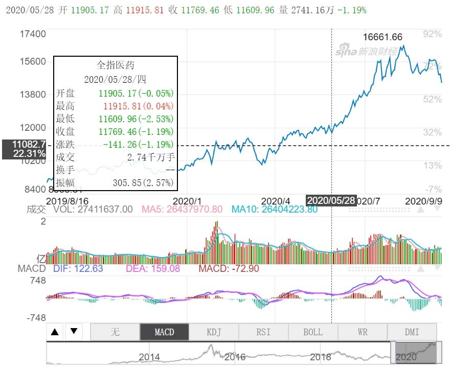
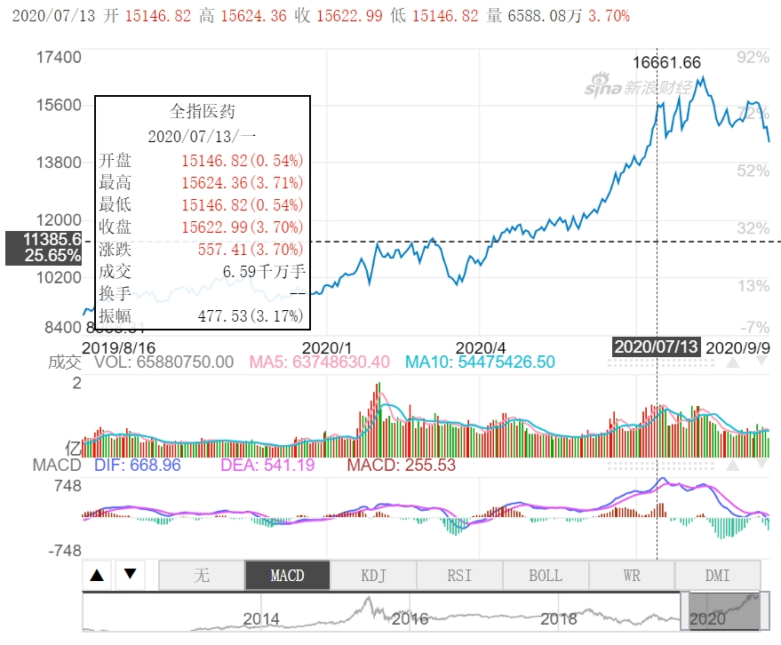
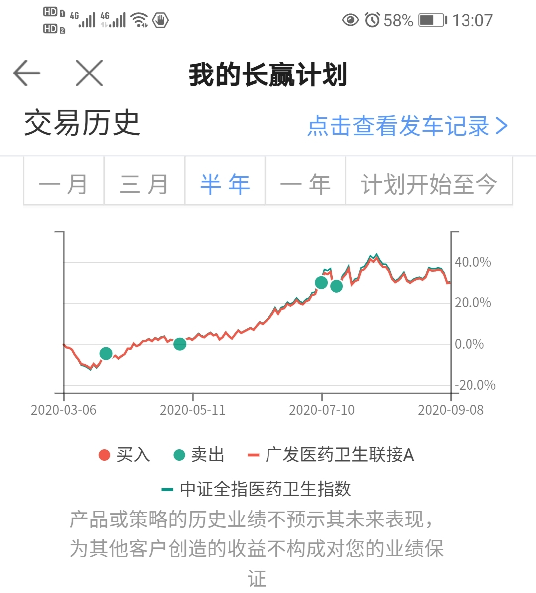

> 医药下方重要支撑线是**12000点**。上方压力线依然是**15500**。一切尽在掌握。//@ETF拯救世界:折腾了一个半月，我军15500防线固若金汤。//@ETF拯救世界:回来了老弟。//@ETF拯救世界:在大气层激烈争夺。15500不是那么容易过的。
>
> 2020年9月9日
>
>  <https://weibo.com/chinaetfs?is_all=1#_rnd1599621197615> 
>
> 
>
> [**@ETF****拯救世界**](https://weibo.com/chinaetfs?refer_flag=1005055013_)
>
> 医药基本已经脱离我能理解的范畴，进入“外太空”区域。 
>
> 在这个区域，我将用**新的交易策略**处理剩下的仓位。 
>
> 踏踏实实的。 
>
> [7月13日 11:26](https://weibo.com/5687069307/JaZgDapRK) 

搜了下，发现E大说的是全指医药“**全指医药(000991.SH)**”

五月底，从11900进入加速上涨：

E大发表评论的7月13日，收盘超过E大说的压力线15500：

7月13日前的半年时间里，长赢计划卖出4份医药：

**目前持仓还有6份，已经盈利73%**。从7月13日到今天，9月9日，多次穿越15500压力线，在“外太空”和内太空之间来回穿梭。E大所说的“新交易策略”，应该是说，现在E大的止盈策略这一轮有了更新，虽然估值已经非常高，但剩下的6份医药，不会轻易卖出。具体新策略是怎样的呢？好奇ing...

